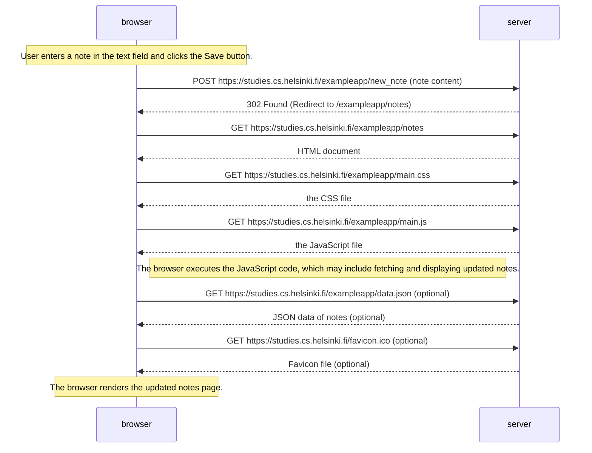

```mermaid
sequenceDiagram
    participant browser
    participant server

    Note over browser: User enters a note in the text field and clicks the Save button.

    browser->>server: POST https://studies.cs.helsinki.fi/exampleapp/new_note (note content)
    server-->>browser: 302 Found (Redirect to /exampleapp/notes)

    browser->>server: GET https://studies.cs.helsinki.fi/exampleapp/notes
    server-->>browser: HTML document

    browser->>server: GET https://studies.cs.helsinki.fi/exampleapp/main.css
    server-->>browser: the CSS file

    browser->>server: GET https://studies.cs.helsinki.fi/exampleapp/main.js
    server-->>browser: the JavaScript file

    Note right of browser: The browser executes the JavaScript code, which may include fetching and displaying updated notes.

    browser->>server: GET https://studies.cs.helsinki.fi/exampleapp/data.json (optional)
    server-->>browser: JSON data of notes (optional)

    browser->>server: GET https://studies.cs.helsinki.fi/favicon.ico (optional)
    server-->>browser: Favicon file (optional)

    Note over browser: The browser renders the updated notes page.

```