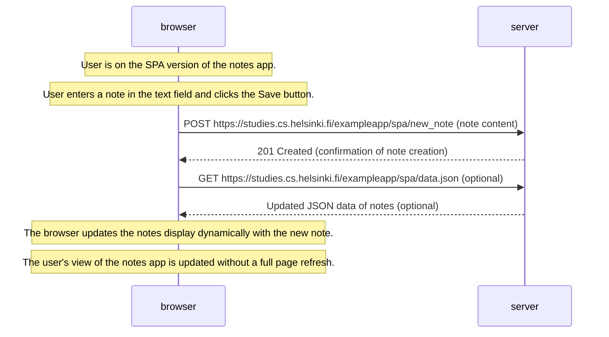

```mermaid
sequenceDiagram
    participant browser
    participant server

    Note over browser: User is on the SPA version of the notes app.

    Note over browser: User enters a note in the text field and clicks the Save button.

    browser->>server: POST https://studies.cs.helsinki.fi/exampleapp/spa/new_note (note content)
    server-->>browser: 201 Created (confirmation of note creation)
    

    browser->>server: GET https://studies.cs.helsinki.fi/exampleapp/spa/data.json (optional)
    server-->>browser: Updated JSON data of notes (optional)

    Note over browser: The browser updates the notes display dynamically with the new note.

    Note over browser: The user's view of the notes app is updated without a full page refresh.
```